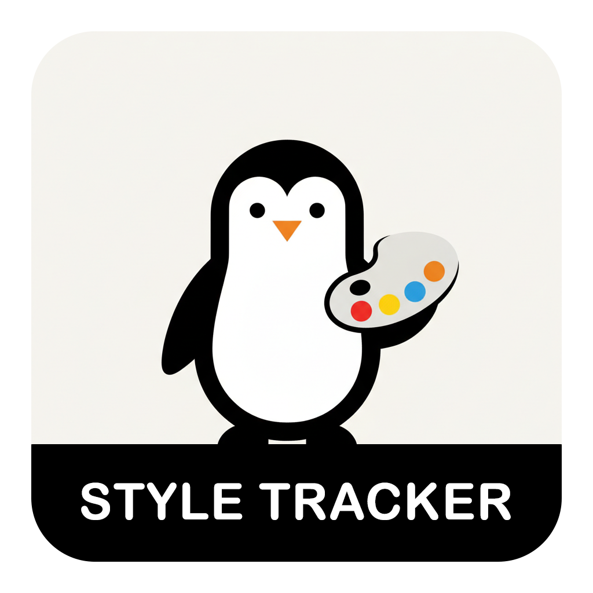

# Style Tracker

<p align="center">
  
</p>

> **Instantly locate and highlight CSS styles for any HTML element, class, or ID in your code**

Track CSS rules in real-time as you navigate through your HTML, JSX, and other markup files. Style Tracker opens a split view showing the exact CSS code for the element under your cursor.

**Official Website**: [bashademy.com](https://bashademy.com/)

---

## Screenshots

### Tracking CSS Classes


### Enable and Dsable Tracking


---

## Features

### Real-Time CSS Tracking
- **Automatic Detection**: Move your cursor over any CSS class, ID, or HTML element tag to instantly see its styles
- **Split View**: CSS opens in a side-by-side pane with highlighted rules
- **Multiple Sources**: Tracks styles from internal `<style>` tags and external CSS files

### Supported Selectors
- **CSS Classes**: `.button`, `.container`, `.header`
- **IDs**: `#main`, `#sidebar`, `#navigation`
- **HTML Elements**: `body`, `div`, `h1`, `p`, `span`, etc.
- **JSX/React**: Works with `className` attributes in React components

### File Type Support
Works with any file type:
- HTML (`.html`)
- JSX/TSX (`.jsx`, `.tsx`)
- JavaScript/TypeScript (`.js`, `.ts`)
- Vue (`.vue`)
- And more!

### Toggle Tracking
- Click the eye icon in the editor title bar to enable/disable tracking
- Tracking is **enabled by default** when you open files

---

## Usage

### Basic Usage

1. **Open any HTML, JSX, or markup file**
2. **Move your cursor** to a CSS class, ID, or HTML tag
3. **Watch the magic**: A split view opens showing the CSS rule with highlighting

### Examples

#### Tracking a CSS Class
```html
<div class="container">
  <!--      ^^^^^^^^^
       Hover here to see .container styles -->
</div>
```

#### Tracking an ID
```html
<nav id="main-menu">
  <!--    ^^^^^^^^^
     Hover here to see #main-menu styles -->
</nav>
```

#### Tracking HTML Elements
```html
<body>
<!-- ^
  Hover here to see body styles -->
  <h1>Title</h1>
  <!-- ^
    Hover here to see h1 styles -->
</body>
```

#### Works with Internal CSS
```html
<style>
  .card {
    padding: 20px;
    background: white;
  }
</style>

<div class="card">Content</div>
<!--      ^^^^ Hover to highlight the .card rule above -->
```

#### Works with External CSS
```html
<link rel="stylesheet" href="styles.css">
<div class="header">
<!--      ^^^^^^ Opens styles.css and highlights .header rule -->
</div>
```

### Toggle Tracking On/Off

Click the **eye icon** in the editor title bar:
- **Eye open** = Tracking enabled
- **Eye closed** = Tracking disabled

---

## Installation

### From Source (Development)

1. Clone the repository:
   ```bash
   git clone <repository-url>
   cd style-tracker
   ```

2. Install dependencies:
   ```bash
   npm install
   ```

3. Build the extension:
   ```bash
   npm run build
   ```

4. Press `F5` in VS Code to launch the extension in a new window

### From VSIX (Coming Soon)
```bash
code --install-extension style-tracker-1.0.0.vsix
```

---

## Commands

| Command | Description |
|---------|-------------|
| `Track CSS for HTML element` | Manually trigger CSS tracking for current cursor position |
| `Enable CSS Tracking` | Turn on automatic CSS tracking |
| `Disable CSS Tracking` | Turn off automatic CSS tracking |
| `Close CSS Tracker` | Close the CSS preview pane |

---

## Requirements

- Visual Studio Code `^1.80.0` or higher
- TypeScript `^5.1.6` (for development)

---

## Known Limitations

- **External CDN links** (like Bootstrap from CDN) cannot be tracked as they're remote files
- **Minified CSS** may be harder to read but will still be highlighted
- **Dynamic classes** added via JavaScript won't be detected automatically

---

## Tips & Tricks

**Tip 1: Quick Navigation**
> Move your cursor between different classes to quickly compare their styles

**Tip 2: Multiple Classes**
> When an element has multiple classes, hover over each one individually to see its styles

**Tip 3: Keyboard Shortcuts**
> Use `Ctrl+Shift+P` (or `Cmd+Shift+P`) and search for "Track CSS" to access commands

---

## Contributing

Contributions are welcome! Please feel free to submit a Pull Request.

### Development Setup

1. Fork and clone the repository
2. Install dependencies: `npm install`
3. Make your changes
4. Build: `npm run build`
5. Test in VS Code by pressing `F5`

---

## License

ISC

---

## Changelog

### Version 1.0.0
- Initial release
- Real-time CSS tracking for classes, IDs, and HTML elements
- Support for internal and external CSS files
- Toggle tracking on/off with editor icon
- Works with HTML, JSX, TSX, and other file types

---

Made with d for developers who love clean code and fast workflows
